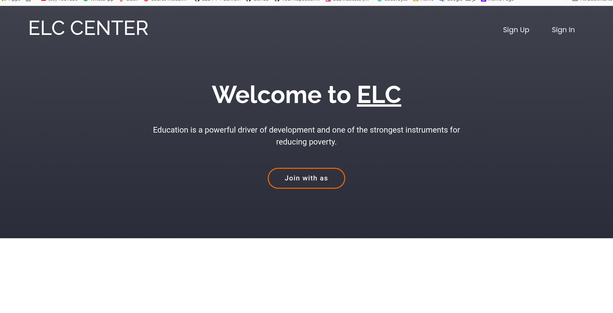

# Elc-Center

**Elc-Center** is a project for small institute use CRUD system and deal with database to save the data

> Getting started:

1. go to your git bash and type **"git clone link"** and execute.

```bash
git clone https://github.com/devHassan19/ELC-Center
```

2. open the project in visual studio code

3. link the project with mongo DB

4.run the local server

5. test the project and enjoy it

> Technologies used:

- **_JavaScript_** -**_HTML_** -**_CSS_**-**_EJS_**-**_MONGO_DB_**


